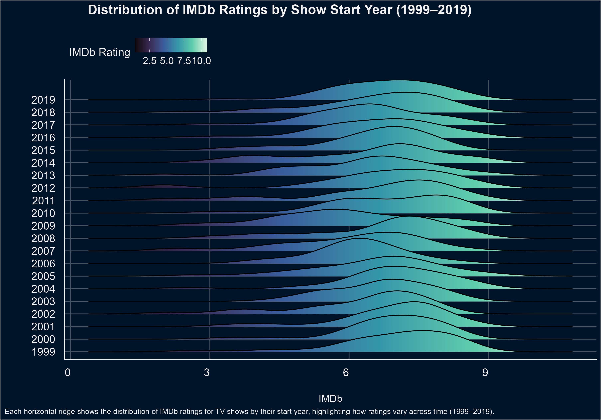
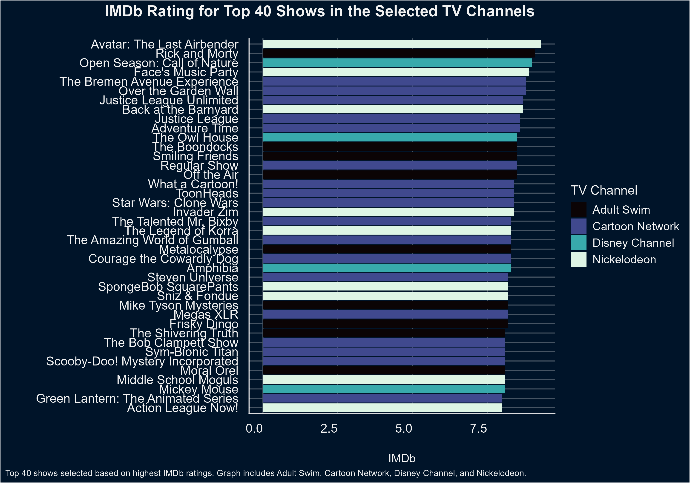
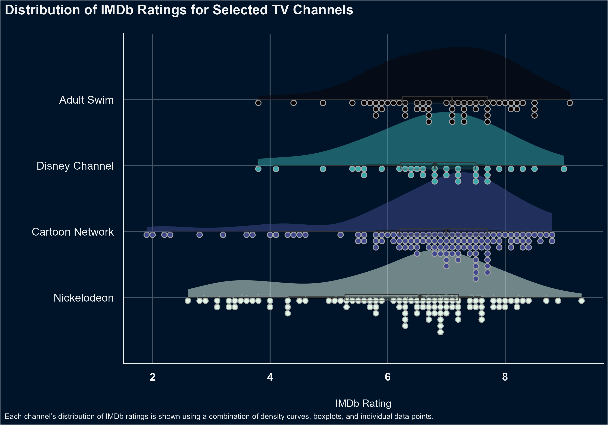

```{r}
library(readr)
library(dplyr)
library(janitor)
library(forcats)
library(tidyverse)
library(stringr)
library(ggplot2)
library(ggdist)
library(ggridges)
tvseries<- read_csv("data/Animated_Tv_Series.csv")

```

```{r}
#| label: data-cleaning
tvclean <- tvseries |>
  clean_names() |>
  select(id, title, episodes, year, original_channel, im_db) |>
  drop_na() |>
   mutate(year = str_replace_all(year, "-", "-"),
          start_year = readr::parse_number(year),
          end_year = readr::parse_number(stringr::str_extract(year, "(?<=-)\\d{4}")),
          new_title = str_remove(title, "\\s*\\(\\d{4}\\)$")) #see chat gpt conversation.txt
  write_csv(tvclean, "data/tvclean.csv") 
```

```{r}
#| label: visualization-1
#| fig-height: 8
#| fig-width: 10
#| fig-alt: "Ridge plot showing distribution of IMDb ratings for Tv shows by their start year (1999-2019), illustrating how distributions vary across years. Each ridge represents the year and each show was released within that year"

 r<- tvclean |>
  filter(start_year >= 1999, start_year <= 2019) |> #filtering from these specific years
  ggplot(aes(x = im_db, y = factor(start_year), fill = ..x..)) +
  geom_density_ridges_gradient(scale = 2) +
  scale_fill_viridis_c(option = "mako") +
  labs(y = "", 
       x = "IMDb",
       title = "Distribution of IMDb Ratings by Show Start Year (1999–2019)",
       fill = "IMDb Rating",
       caption = "Each horizontal ridge shows the distribution of IMDb ratings for TV shows by their start year, highlighting how ratings vary across time (1999–2019).") +
  theme_abyss() +
  theme(axis.text.x = element_text(angle = 0, hjust = 1)) +
  theme( plot.title = element_text(size = 16, face = "bold", hjust = 0.4),
    axis.title.x = element_text(size = 12, face = "plain"),
    plot.title.position = "plot",
    axis.text.y = element_text(size = 13, face = "plain"), #changes size of channels on the y axis
    axis.text.x = element_text(size = 13, face = "plain"),
    legend.title = element_text(face = "plain"),
    legend.position = "top", legend.justification = "left",
    plot.caption.position = "plot", 
    plot.caption = element_text(size = 9, hjust = 0))
ggsave("imdb_ridge_plot.png", plot = r, width = 10, height = 7)
```

```{r}
#| label: visualization-2
#| fig-height: 9
#| fig-width: 10
#| fig-alt: "A barplot showing the IMDb rating for the top 40 TV shows in decending order that are produced by Adult Swim, Cartoon Network, Disney Channel and Nickelodeon."
#tv show versus imdb
 b<-tvclean|>
  filter(original_channel %in% c("Adult Swim", "Cartoon Network", "Disney Channel", "Nickelodeon")) |>
  arrange(desc(im_db)) |>
  slice_head(n = 40) |> #did top 40 because plotting more than 40 shows looked hectic.
  ggplot(aes(x = im_db, y = reorder(new_title, im_db, .desc = TRUE), fill = original_channel)) +
  geom_col() +
  labs(x= "IMDb",
       y = "",
      fill = "TV Channel",
      title = "IMDb Rating for Top 40 Shows in the Selected TV Channels",
      caption = "Top 40 shows selected based on highest IMDb ratings. Graph includes Adult Swim, Cartoon Network, Disney Channel, and Nickelodeon.") +
  theme_abyss() +
  scale_fill_viridis_d(option = "mako") +
  theme(axis.text.x = element_text(angle = 0, hjust = 1)) +
   theme( plot.title = element_text(size = 16, face = "bold", hjust = 0.4),
    axis.title.x = element_text(size = 12, face = "plain"),
    plot.title.position = "plot",
    axis.text.y = element_text(size = 13, face = "plain"), #changes size of channels on the y axis
    axis.text.x = element_text(size = 13, face = "plain"),
    legend.title = element_text(face = "plain"),
    plot.caption.position = "plot", 
    plot.caption = element_text(size = 9, hjust = 0)) 
ggsave("imdb_bar_plot.png", plot = b, width = 10, height = 7)
```


```{r}
#| label: Visualization 3
#| fig-height: 7
#| fig-alt: "Raincloud plot comparing IMDb rating distributions for TV shows by Tv channels combining density curves, boxplots and individual show ratings for Adult Swim, Cartoon Network, Disney Channel, and Nickelodeon. Also highlighting differences in spread and central tendency."

cloud<-tvclean |>
  filter(original_channel %in% c("Adult Swim", "Cartoon Network", "Disney Channel", "Nickelodeon")) |>
  arrange(desc(original_channel)) |>
  ggplot(aes(x = im_db, y = reorder(original_channel,im_db), fill = original_channel))  +

  stat_halfeye(alpha = 0.5) +
  stat_dots(side = "bottom") +
  geom_boxplot(alpha = .2, width=0.1) +
  geom_jitter(aes(color = original_channel),
              height = 0.05,
              size = 0.2,
              alpha = 0.2) +
  labs(x = "IMDb Rating", 
       y = "",
       title = "Distribution of IMDb Ratings for Selected TV Channels",
       caption = "Each channel’s distribution of IMDb ratings is shown using a combination of density curves, boxplots, and individual data points.") +
  theme_abyss() +
  scale_fill_viridis_d(option = "mako") +
  scale_color_viridis_d(option = "mako") + 
  guides(color = "none", fill = "none") +
  theme( plot.title = element_text(size = 16, face = "bold"),
    axis.title.x = element_text(size = 12, face = "plain"),
    axis.text.y = element_text(size = 13, face = "plain"), #changes size of channels on the y axis
    axis.text.x = element_text(size = 13, face = "bold"), #changes size of imdb numbers 
    plot.caption.position = "plot", 
    plot.caption = element_text(size = 9, hjust = 0)) 
ggsave("imdb_cloud_plot.png", plot = cloud, width = 10, height = 7)
```


### **Data Description**

The data set used in this project was obtained from Kaggle and contains information about a variety of television series. I selected this data set because it includes many shows that I watched growing up, making it both personally interesting and enjoyable to analyze. The data set includes variables such as television show titles, original channels, IMDb ratings, Google user ratings, number of episodes, years the shows aired and production techniques. For this project, I focused on the variables related to show titles, years on air, television channels, and IMDb ratings in order to explore trends and differences in television ratings across time and networks.

Research Questions:

- How do distributions of the IMDb ratings for TV shows based on their start year across the time period 1999-2019 vary?
- What are the top rated TV shows based on IMDb between  Adult swim, Cartoon Network, Disney Channel, Nickelodeon?
- What is the highest rated TV show in between Adult swim, Cartoon Network, Disney Channel, Nickelodeon? based on IMDb

I selected the years 1999–2019 to examine a 20-year period while excluding years affected by the COVID-19 pandemic, since the pandemic may have influenced television production and audience ratings. Including all years in the data set resulted in an overcrowded visualization, so the ridge-plot visualization was limited to this time range to improve readability. Similarly, for the bar chart visualization, only the top 40 shows were included because plotting a larger number of shows made the graph appear overly crowded and difficult to interpret.

### **Data Cleaning**


 I first started by cleaning the names and then selecting the variables I was going to use for my visualizations, imdb, tv channel, title, and year. I then dropped any na values from the data. The year column had the start and end year of each show, so I had to create a two new columns, one with only the start year and the other with the end year. Some of the TV shows had the start and end date embedded into the title so I asked chat GPT how to use string r text to extract the numbers and characters out of the titles. Lastly, I saved the cleaned data set as an object then a csv file and placed into a data folder. I did additional data cleaning that were specific to each visualization. For the first visualization: "Distribution of IMDb Ratings by Show Start Year (1999–2019)," I filtered the cleaned data set to include only television shows with start years between 1999 and 2019. For the second visualization: "IMDb Rating for Top 40 Shows in the Selected TV Channels," I filtered the data set to include four TV Channels: Adult Swim, Cartoon Network, Disney Channel, and Nickelodeon. I chose these channels they ones I watched growing up and provided an interesting basis for comparison. I then arranged  in descending order by IMDb rating, and only the top 40 shows were included to maintain readability and reduce overcrowding. For the third visualization: "Distribution of IMDb Ratings for Selected TV Channels," I again filtered the data set to include the same four TV Channels and arranged in descending order by TV channel.
 

### **Visualization 1**

 For my first visualization I created a ridgeline plot with density. Each ridgeline represents the start year of all the shows that were released in that year, and the x axis is mapped to IMDb rating. It shows a summary of all the shows for each year. So "Regular Show", for instance, was released in 2010, so regular show will only be plotted in that year. 



### **Visualization 2**

 For the second visualization I created a barplot in descending order to show the top rated show (based on IMDb) within the four selected TV channels, Adult Swim, Cartoon Network, Disney Channel, Nickelodeon specific channel. The TV show with the highest IMDb rating is "Avatar: The Last Airbender" Produced by Nickelodeon.



### **Visualization 3**

 Lastly, I wanted to look at the distributions of IMDb ratings of TV shows within the four TV channels selected and if one on average had a higher IMDb rating than the other three. So I created a raincloud plot. All four distributions have roughly the same mean and median. The distribution of TV channel Nickelodeon has more spread than the other three channels. 




